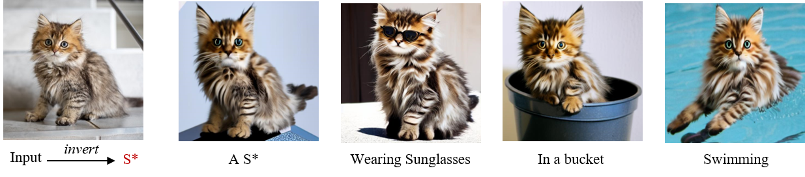
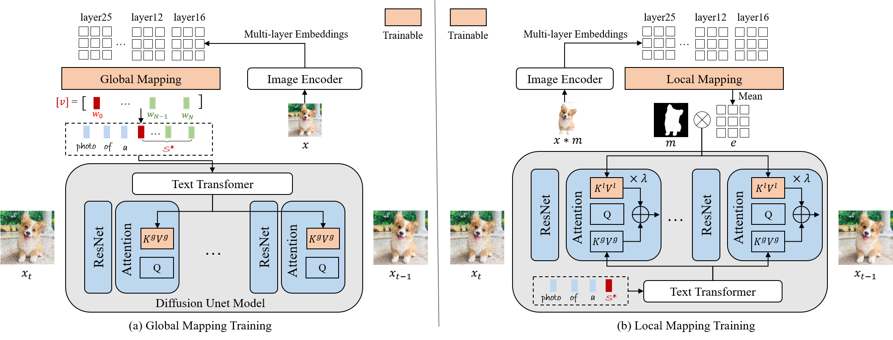

# ELITE Tutorial for Customized Text-to-Image Generation





## Method Details



Given an image indicates the target concept (usually an object), we propose a learning-based encoder ELITE to encode the visual concept into the textual embeddings, which can be further flexibly composed into new scenes.  It consists of two modules: (a) a global mapping network is first trained to encode a concept image into multiple textual word embeddings, where one primary word (w0) for well-editable concept and other auxiliary words (w1···N) to exclude irrelevant disturbances. (b) A local mapping network is further trained, which projects the foreground object into textual feature space to provide local details.


## Getting Started

### Environment Setup

```shell
git clone https://github.com/csyxwei/ELITE.git
cd ELITE-Tutorial
conda create -n elite python=3.9
conda activate elite
pip install -r requirements.txt
```

### Pretrained Models

Download checkpoints in [Google Drive](https://drive.google.com/drive/folders/1y7KOo8T7FkknWLbFrbAvgYbha2xipXYs?usp=drive_link). Then save to the directory `./checkpoints`.

How to download files from Google Drive in Linux? -> check out [gdown](https://github.com/wkentaro/gdown).

### Customized Generation

There are some testing pairs in [test_datasets](./test_datasets), which contain both images and object masks. 

For testing, you can run the shell script.
```
bash inference_local.sh
```
Change the image folder (DATA_DIR) and prompt (template) for your own customization.

If you want to test your customized dataset, you should align the image to ensure the object is at the center of image, and also provide the corresponding object mask. 

The object mask can be obtained by any image matting method. Try [SAM](https://segment-anything.com/)!

SAM [demo](https://segment-anything.com/demo) and [GitHub](https://github.com/facebookresearch/segment-anything).
